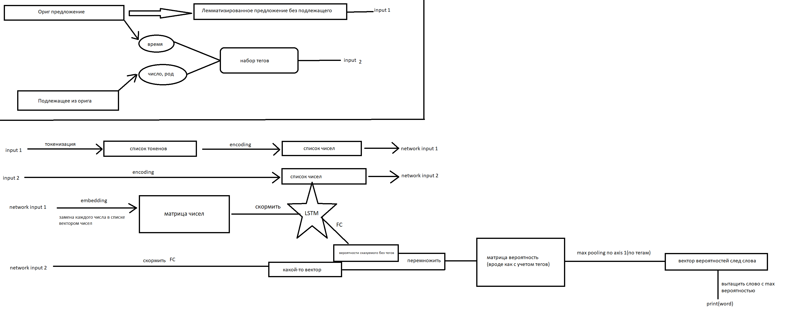
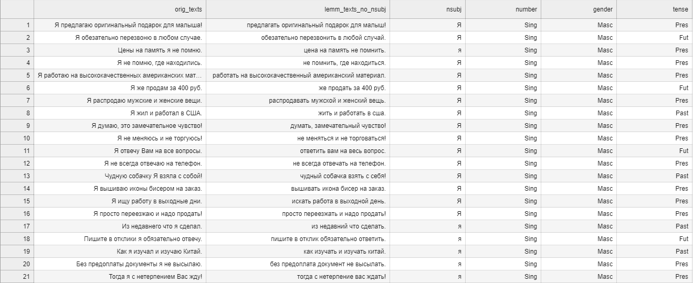

# Де-лемматизация текста
## Краткое описание проекта
В безличное предложение или предложение, написанное от третьего лица, подставим начальное слово (местоимение: я, он, она; любое слово: студент, требуется). Генеративная модель детектирует подсказку в виде этого местоимения и переписывает предложение от заданного лица (меняет окончания и род слов).

## Идея реализации проекта
Для начала разделим датасет с предложениями на 2 части: оригинальные предложения и лемматизированные предложения, в которых отсутствуют подлежащие(input 1). Из оригинальных предложений берем время у сказуемого и вместе с числом и родом подлежащего из лемматизированного предложения собираем набор тэгов(время+число+род)(input 2).
### Обучение нейросети
Лемматизированное предложение без подлежащего(input 1) токенизируем и кодируем каждый токен числом, в итоге получая список чисел. Набор тэгов(input 2) также кодируем числом. Затем применяем embedding к списку чисел input 1, получив матрицу, которую скармливаем в LSTM и прогоняем через FC слой, тем самым получая распределение вероятностей следующего слова без учета тэгов. Список чисел input 2 так же прогоняем через FC слой. Полученный вектор перемножаем с распределением вероятностей, получив матрицу вероятностей следующего слова уже с учетом тэгов. Применяем max pooling по оси с тэгами к матрице и получаем вектор вероятностей следующего слова. Вытаскиваем слово с наибольшей вероятностью и выводим его. Повторяем для каждого предложения в датасете.
### Схема того, как оно устроено

### Слайс данных

